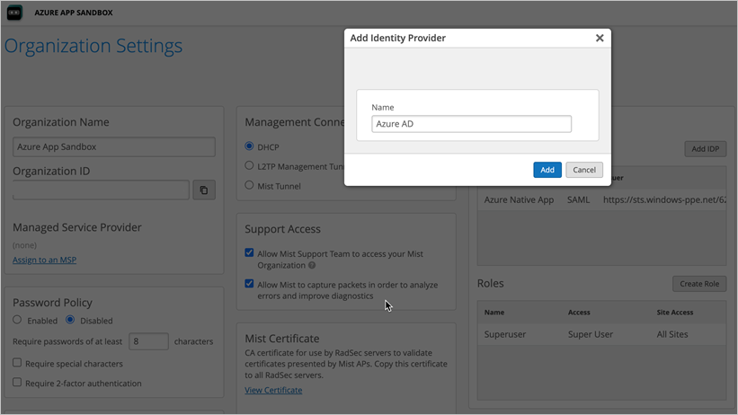
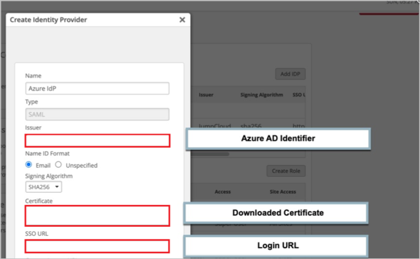
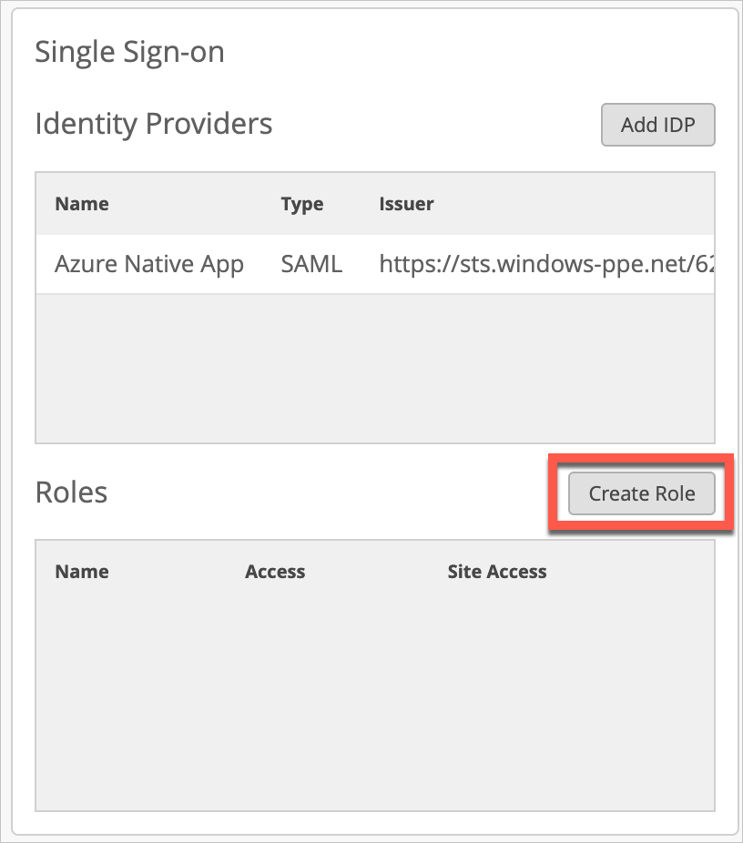

# Tutorial: Azure AD SSO integration with Mist Cloud Admin SSO

In this tutorial, you'll learn how to integrate Mist Cloud Admin SSO with Azure Active Directory (Azure AD). When you integrate Mist Cloud Admin SSO with Azure AD, you can:

* Control in Azure AD who has access to the Mist dashboard.
* Enable your users to be automatically signed-in to the Mist dashboard with their Azure AD accounts.
* Manage your accounts in one central location - the Azure portal.

## Prerequisites

To get started, you need the following items:

* An Azure AD subscription. If you don't have a subscription, you can get a [free account](https://azure.microsoft.com/free/).
* Mist Cloud account, you can create an account [here](https://manage.mist.com/).
* Along with Cloud Application Administrator, Application Administrator can also add or manage applications in Azure AD.
For more information, see [Azure built-in roles](../roles/permissions-reference.md).

## Scenario description

In this tutorial, you configure and test Azure AD SSO in a test environment.

* Mist Cloud Admin SSO supports **SP** and **IDP** initiated SSO.

## Add Mist Cloud Admin SSO from the gallery

To configure the integration of Mist Cloud Admin SSO into Azure AD, you need to add Mist Cloud Admin SSO from the gallery to your list of managed SaaS apps.

1. Sign in to the Azure portal using either a work or school account, or a personal Microsoft account.
1. On the left navigation pane, select the **Azure Active Directory** service.
1. Navigate to **Enterprise Applications** and then select **All Applications**.
1. To add new application, select **New application**.
1. In the **Add from the gallery** section, type **Mist Cloud Admin SSO** in the search box.
1. Select **Mist Cloud Admin SSO** from results panel and then add the app. Wait a few seconds while the app is added to your tenant.

## Configure and test Azure AD SSO for Mist Cloud Admin SSO

Configure and test Azure AD SSO with Mist Cloud Admin SSO using a test user called **B.Simon**. For SSO to work, you need to establish a link between your Azure AD app and Mist organization SSO.

To configure and test Azure AD SSO with Mist Cloud Admin SSO, perform the following steps:

1.	**[Perform initial configuration of the Mist Cloud SSO](#perform-initial-configuration-of-the-mist-cloud-sso)** - to generate ACS URL on the application side.
1. **[Configure Azure AD SSO](#configure-azure-ad-sso)** - to enable your users to use this feature.
    1.	**[Create Role for the SSO Application](#create-role-for-the-sso-application)**
    1. **[Create an Azure AD test user](#create-an-azure-ad-test-user)** - to test Azure AD single sign-on with B.Simon.
    1. **[Assign the Azure AD test user](#assign-the-azure-ad-test-user)** - to enable B.Simon to use Azure AD single sign-on.

1.	**[Complete configuration of the Mist Cloud](#complete-configuration-of-the-mist-cloud)**

1.	**[Create Roles to link roles sent by the Azure AD](#create-roles-to-link-roles-sent-by-the-azure-ad)**

1. **[Test SSO](#test-sso)** - to verify whether the configuration works.

## Perform Initial Configuration of the Mist Cloud SSO

1.	Sign in to the Mist dashboard using a local account.
2.	Go to **Organization > Settings > Single Sign-On > Add IdP**.
3.	Under **Single Sign-On** section select **Add IDP**.
4.	In the **Name** field type `Azure AD` and select **Add**.

    

1. Copy **Reply URL** value, paste this value into the **Reply URL** text box in the **Basic SAML Configuration** section in the Azure portal.

    

## Configure Azure AD SSO

Follow these steps to enable Azure AD SSO in the Azure portal.

1. In the Azure portal, on the **Mist Cloud Admin SSO** application integration page, find the **Manage** section and select **single sign-on**.
1. On the **Select a single sign-on method** page, select **SAML**.
1. On the **Set up single sign-on with SAML** page, click the pencil icon for **Basic SAML Configuration** to edit the settings.

    

1. On the **Basic SAML Configuration** section, perform the following steps:

    a. In the **Identifier** textbox, type a value using the following pattern:
    `https://api.<MISTCLOUDREGION>.mist.com/api/v1/saml/<SSOUNIQUEID>/login`

    b. In the **Reply URL** textbox, type a URL using the following pattern:
    `https://api.<MISTCLOUDREGION>.mist.com/api/v1/saml/<SSOUNIQUEID>/login`

1. Click **Set additional URLs** and perform the following step, if you wish to configure the application in **SP** initiated mode:

    In the **Sign-on URL** text box, type the URL:
    `https://manage.mist.com`

    > [!Note]
    > These values are not real. Update these values with the actual Identifier and Reply URL. Contact [Mist Cloud Admin SSO support team](mailto:support@mist.com) to get these values. You can also refer to the patterns shown in the **Basic SAML Configuration** section in the Azure portal.

1. Mist Cloud Admin SSO application expects the SAML assertions in a specific format, which requires you to add custom attribute mappings to your SAML token attributes configuration. The following screenshot shows the list of default attributes.

    

1. In addition to above, Mist Cloud Admin SSO application expects few more attributes to be passed back in SAML response, which are shown below. These attributes are also pre populated but you can review them as per your requirements.

    | Name | Source Attribute|
    | ------------ | --------- |
    | FirstName | user.givenname |
    | LastName | user.surname |
    | Role | user.assignedroles |

   > [!NOTE]
   > Please click [here](../develop/howto-add-app-roles-in-azure-ad-apps.md#app-roles-ui) to know how to configure Role in Azure AD.
   > Mist Cloud requires Role attribute to assign correct admin privileges to the user.

1. On the **Set up single sign-on with SAML** page, in the **SAML Signing Certificate** section,  find **Certificate (Base64)** and select **Download** to download the certificate and save it on your computer.

    

1. 8. On the **Set up Mist Cloud Admin SSO** section, copy the appropriate **Login URL** and **Azure AD Identifier**.

	

### Create Role for the SSO Application

In this section, you'll create a Superuser Role to later assign it to test user B.Simon.
 
1.	In the Azure portal, select **App Registrations**, and then select **All Applications**.
2.	In the applications list, select **Mist Cloud Admin SSO**.
3.	In the app's overview page, find the **Manage** section and select **App Roles**.
4.	Select **Create App Role**, then type **Mist Superuser** in the **Display Name** field.
5.	Type **Superuser** in the **Value** field, then type **Mist Superuser Role** in the **Description** field, then select **Apply**.

### Create an Azure AD test user

In this section, you'll create a test user in the Azure portal called B.Simon.

1. From the left pane in the Azure portal, select **Azure Active Directory**, select **Users**, and then select **All users**.
1. Select **New user** at the top of the screen.
1. In the **User** properties, follow these steps:
   1. In the **Name** field, enter `B.Simon`.  
   1. In the **User name** field, enter the username@companydomain.extension. For example, `B.Simon@contoso.com`.
   1. Select the **Show password** check box, and then write down the value that's displayed in the **Password** box.
   1. Click **Create**.

### Assign the Azure AD test user

In this section, you'll enable B.Simon to use Azure single sign-on by granting access to Mist Cloud Admin SSO.

1. In the Azure portal, select **Enterprise Applications**, and then select **All applications**.
1. In the applications list, select **Mist Cloud Admin SSO**.
1. In the app's overview page, find the **Manage** section and select **Users and groups**.
1. Select **Add user**, then select **Users and groups** in the **Add Assignment** dialog.
1. In the **Users and groups** dialog, select **B.Simon** from the Users list, then click the **Select** button at the bottom of the screen.
1. 6.	Click Select a **Role**, then select **Mist Superuser** and click **Select**.
1. In the **Add Assignment** dialog, click the **Assign** button.

## Complete configuration of the Mist Cloud

1. In the **Create Identity Provider** section, perform the following steps:

    

    1. In the **Issuer** textbox, paste the **Azure AD Identifier** value which you have copied from the Azure portal.

    1. Open the downloaded **Certificate (Base64)** from the Azure portal into Notepad and paste the content into the **Certificate** textbox.

    1. In the **SSO URL** textbox, paste the **Login URL** value which you have copied from the Azure portal.

    1. Click **Save**.

## Create Roles to link roles sent by the Azure AD

1. In the Mist dashboard navigate to **Organization > Settings**. Under **Single Sign-On** section, select **Create Role**.

    

1. Role name must match Role claim value sent by Azure AD, for example type `Superuser` in the **Name** field, specify desired admin privileges for the role and select **Create**.

    

## Test SSO 

In this section, you test your Azure AD single sign-on configuration with following options. 

#### SP initiated:

* Click on **Test this application** in Azure portal. This will redirect to Mist Cloud Admin SSO Sign-on URL where you can initiate the login flow.  

* Go to Mist Cloud Admin SSO Sign-on URL directly and initiate the login flow from there.

    > [!NOTE]
    > For each user first login must be performed from the IdP prior to using SP initiated flow.

#### IDP initiated:

* Click on **Test this application** in Azure portal and you should be automatically signed in to the Mist Cloud Admin SSO for which you set up the SSO. 

You can also use Microsoft My Apps to test the application in any mode. When you click the Mist Cloud Admin SSO tile in the My Apps, if configured in SP mode you would be redirected to the application sign-on page for initiating the login flow and if configured in IDP mode, you should be automatically signed in to the Mist Cloud Admin SSO for which you set up the SSO. For more information about the My Apps, see [Introduction to the My Apps](../user-help/my-apps-portal-end-user-access.md).

## Next steps

Once you configure Mist Cloud Admin SSO you can enforce session control, which protects exfiltration and infiltration of your organization’s sensitive data in real time. Session control extends from Conditional Access. [Learn how to enforce session control with Microsoft Cloud App Security](/cloud-app-security/proxy-deployment-aad).
