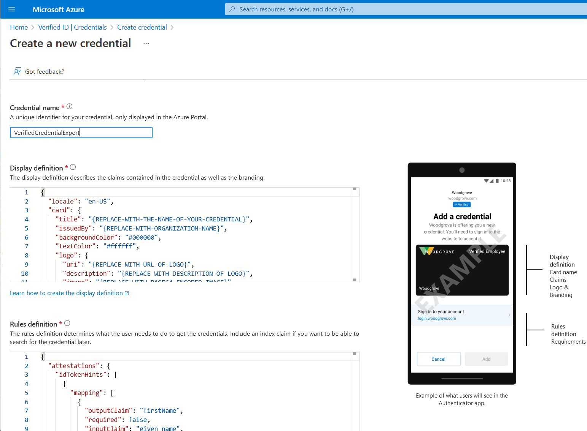
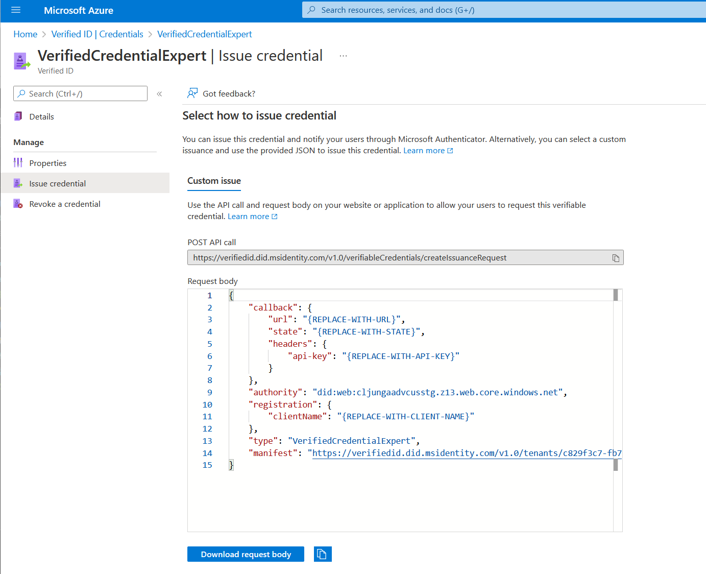

# Create verifiable credentials for ID token hint

[!INCLUDE [Verifiable Credentials announcement](../../../includes/verifiable-credentials-brand.md)]

## Prerequisites

To use the Microsoft Entra Verified ID quickstart, you need only to complete the verifiable credentials onboarding process.

## What is the quickstart?

Entra Verified ID now come with quickstarts in the Azure portal for creating custom credentials. When you use the quickstart, you don't need to edit and upload rules and display files to Azure Storage. Instead, you enter all details in the Azure portal and create the credential on a single page. 

>[!NOTE]
>When you work with custom credentials, you provide display definitions and rules definitions in JSON documents. These definitions are stored with the credential details.

## Create a custom credential

In the Azure portal, when you select **Add credential**, you get the option to launch two quickstarts. Select **custom credential**, and then select **Next**. 


On the **Create a new credential** page, enter the JSON code for the rules and display definitions. In the **Credential name** box, give the credential a type name. To create the credential, select **Create**.



## Sample JSON display definitions

The expected JSON for the display definitions is the inner content of the displays collection. The JSON is a collection, so if you want to support multiple locales, you add multiple entries, with a comma as a separator.

```json
{
    "locale": "en-US",
    "card": {
      "title": "Verified Credential Expert",
      "issuedBy": "Microsoft",
      "backgroundColor": "#000000",
      "textColor": "#ffffff",
      "logo": {
        "uri": "https://didcustomerplayground.blob.core.windows.net/public/VerifiedCredentialExpert_icon.png",
        "description": "Verified Credential Expert Logo"
      },
      "description": "Use your verified credential to prove to anyone that you know all about verifiable credentials."
    },
    "consent": {
      "title": "Do you want to get your Verified Credential?",
      "instructions": "Sign in with your account to get your card."
    },
    "claims": [
      {
        "claim": "vc.credentialSubject.firstName",
        "label": "First name",
        "type": "String"
      },
      {
        "claim": "vc.credentialSubject.lastName",
        "label": "Last name",
        "type": "String"
      }
    ]
}
```

## Sample JSON rules definitions

The expected JSON for the rules definitions is the inner content of the rules attribute, which starts with the attestation attribute.

```json
{
      "attestations": {
        "idTokenHints": [
          {
            "mapping": [
              {
                "outputClaim": "firstName",
                "required": true,
                "inputClaim": "$.given_name",
                "indexed": false
              },
              {
                "outputClaim": "lastName",
                "required": true,
                "inputClaim": "$.family_name",
                "indexed": false
              }
            ],
            "required": false
          }
        ]
      },
      "validityInterval":  2592000,
      "vc": {
        "type": [
          "VerifiedCredentialExpert"
        ]
      }
}
```


## Configure the samples to issue and verify your custom credential

To configure your sample code to issue and verify by using custom credentials, you need:

- Your tenant's issuer decentralized identifier (DID)
- The credential type
- The manifest URL to your credential 

The easiest way to find this information for a custom credential is to go to your credential in the Azure portal. Select **Issue credential**. There you have access to a text box with a JSON payload for the Request Service API. Replace the placeholder values with your environment's information. The issuer’s DID is the authority value.



## Next steps

For more information, see:
- [Rules and display definitions reference](rules-and-display-definitions-model.md)