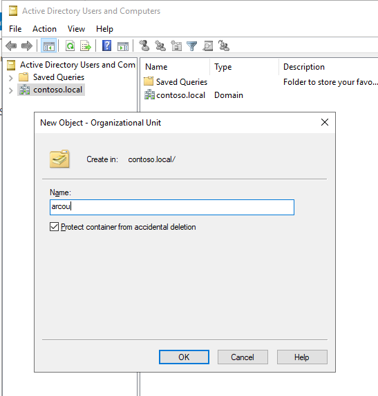
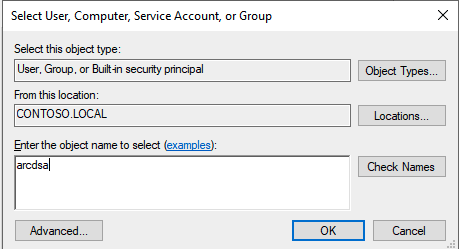
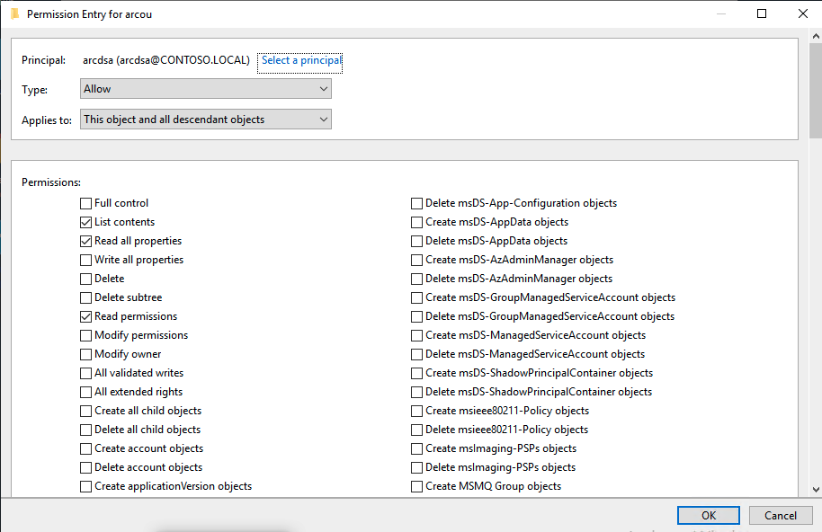

# Azure Arc-enabled SQL Managed Instance in Active Directory authentication with system-managed keytab - prerequisites

This document explains how to prepare to deploy Azure Arc-enabled data services with Active Directory (AD) authentication. Specifically the article describes Active Directory objects you need to configure before the deployment of Kubernetes resources.

[!INCLUDE [azure-arc-data-preview](../../../includes/azure-arc-data-preview.md)]

[The introduction](active-directory-introduction.md#compare-ad-integration-modes) describes two different integration modes:
- *System-managed keytab* mode allows the system to create and manage the AD accounts for each SQL Managed Instance.
- *Customer-managed keytab* mode allows you to create and manage the AD accounts for each SQL Managed Instance.

The requirements and recommendations are different for the two integration modes.


|Active Directory Object|Customer-managed keytab       |System-managed keytab  |
|---------|------------------------------|---------|
|Organizational unit (OU)                |Recommended|Required         |
|Active Directory domain service account (DSA) for Active Directory Connector |Not required|Required         |
|Active directory account for SQL Managed Instance        |Created for each managed instance|System creates AD account for each managed instance|

### DSA account - system-managed keytab mode

To be able to create all the required objects in Active Directory automatically, AD Connector needs a domain service account (DSA). The DSA is an Active Directory account that has specific permissions to create, manage and delete users accounts inside the provided organizational unit (OU). This article explains how to configure the permission of this Active Directory account. The examples call the DSA account `arcdsa` as an example in this article.

### Auto generated Active Directory objects

An Arc-enabled SQL Managed Instance deployment automatically generates accounts in system-managed keytab mode. Each of the accounts represents a SQL Managed Instance and will be managed by the system throughout the lifetime of SQL. These accounts own the Service Principal Names (SPNs) required by each SQL.  

The steps below assume you already have an Active Directory domain controller. If you don't have a domain controller, the following [guide](https://social.technet.microsoft.com/wiki/contents/articles/37528.create-and-configure-active-directory-domain-controller-in-azure-windows-server.aspx) includes steps that can be helpful.

## Create Active Directory objects

Do the following things before you deploy an Arc-enabled SQL Managed Instance with AD authentication:

1. Create an organizational unit (OU) for all Arc-enabled SQL Managed Instance related AD objects. Alternatively, you can choose an existing OU upon deployment.
1. Create an AD account for the AD Connector, or use an existing account, and provide this account the right permissions on the OU created in the previous step.

### Create an OU

System-managed keytab mode requires a designated OU. For customer-managed keytab mode an OU is recommended.

On the domain controller, open **Active Directory Users and Computers**. On the left panel, right-click the directory under which you want to create your OU and select **New**\> **Organizational Unit**, then follow the prompts from the wizard to create the OU. Alternatively, you can create an OU with PowerShell:

```powershell
New-ADOrganizationalUnit -Name "<name>" -Path "<Distinguished name of the directory you wish to create the OU in>"
```

The examples in this article use `arcou` for the OU name.




### Create the domain service account (DSA)

For system-managed keytab mode, you need an AD domain service account.

Create the Active Directory user that you will use as the domain service account. This account requires specific permissions. Make sure that you have an existing Active Directory account or create a new account, which Arc-enabled SQL Managed Instance can use to set up the necessary objects.

To create a new user in AD, you can right-click the domain or the OU and select **New** > **User**:


This account will be referred to as *arcdsa* in this article.

### Set permissions for the DSA

For system-managed keytab mode, you need to set the permissions for the DSA. 

Whether you have created a new account for the DSA or are using an existing Active Directory user account, there are certain permissions the account needs to have. The DSA needs to be able to create users, groups, and computer accounts in the OU. In the following steps, the Arc-enabled SQL Managed Instance domain service account name is `arcdsa`.

> [!IMPORTANT]
> You can choose any name for the DSA, but we do not recommend altering the account name once AD Connector is deployed.

1. On the domain controller, open **Active Directory Users and Computers**, click on **View**, select **Advanced Features**

1. In the left panel, navigate to your domain, then the OU which `arcou` will use

1. Right-click the OU, and select **Properties**.

> [!NOTE]
> Make sure that you have selected **Advanced Features** by right-clicking on the OU, and selecting **View**

1. Go to the Security tab. Select **Advanced Features** right-click on the OU, and select **View**.

    

1. Select **Add...** and add the **arcdsa** user.

    

1. Select the **arcdsa** user and clear all permissions, then select **Advanced**.

1. Select **Add**

    - Select **Select a Principal**, insert **arcdsa**, and select **Ok**.

    - Set **Type** to **Allow**.

    - Set **Applies To** to **This Object and all descendant objects**.

        

    - Scroll down to the bottom, and select **Clear all**.

    - Scroll back to the top, and select:
       - **Read all properties**
       - **Write all properties**
       - **Create User objects**
       - **Delete User objects**

    - Select **OK**.

1. Select **Add**.

    - Select **Select a Principal**, insert **arcdsa**, and select **Ok**.

    - Set **Type** to **Allow**.

    - Set **Applies To** to **Descendant User objects**.

    - Scroll down to the bottom, and select **Clear all**.

    - Scroll back to the top, and select **Reset password**.

    - Select **OK**.

- Select **OK** twice more to close open dialog boxes.

## Next steps

* [Deploy a customer-managed keytab Active Directory (AD) connector](deploy-customer-managed-keytab-active-directory-connector.md)
* [Deploy a system-managed keytab Active Directory (AD) connector](deploy-system-managed-keytab-active-directory-connector.md)
* [Deploy an Azure Arc-enabled SQL Managed Instance in Active Directory (AD)](deploy-active-directory-sql-managed-instance.md)
* [Connect to Azure Arc-enabled SQL Managed Instance using Active Directory authentication](connect-active-directory-sql-managed-instance.md)
